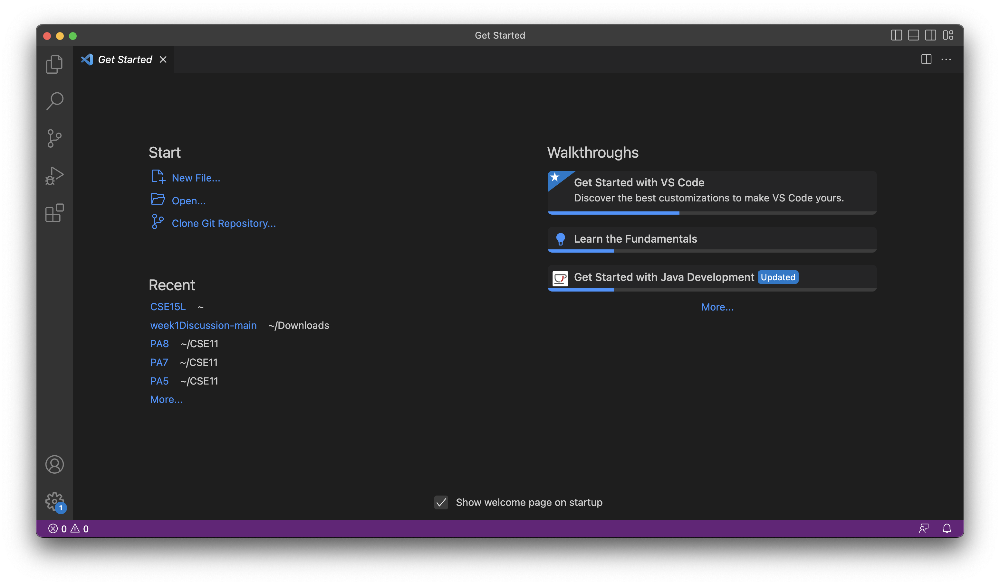
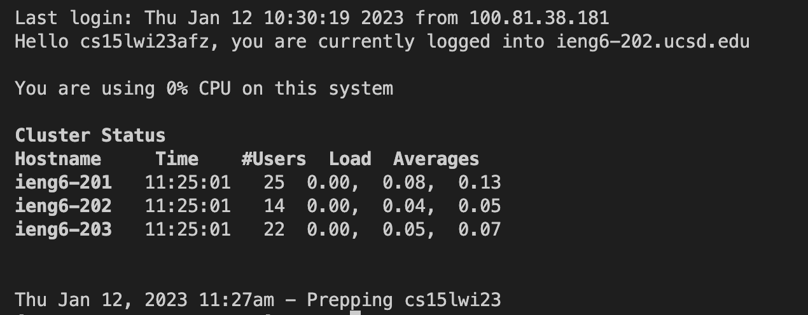
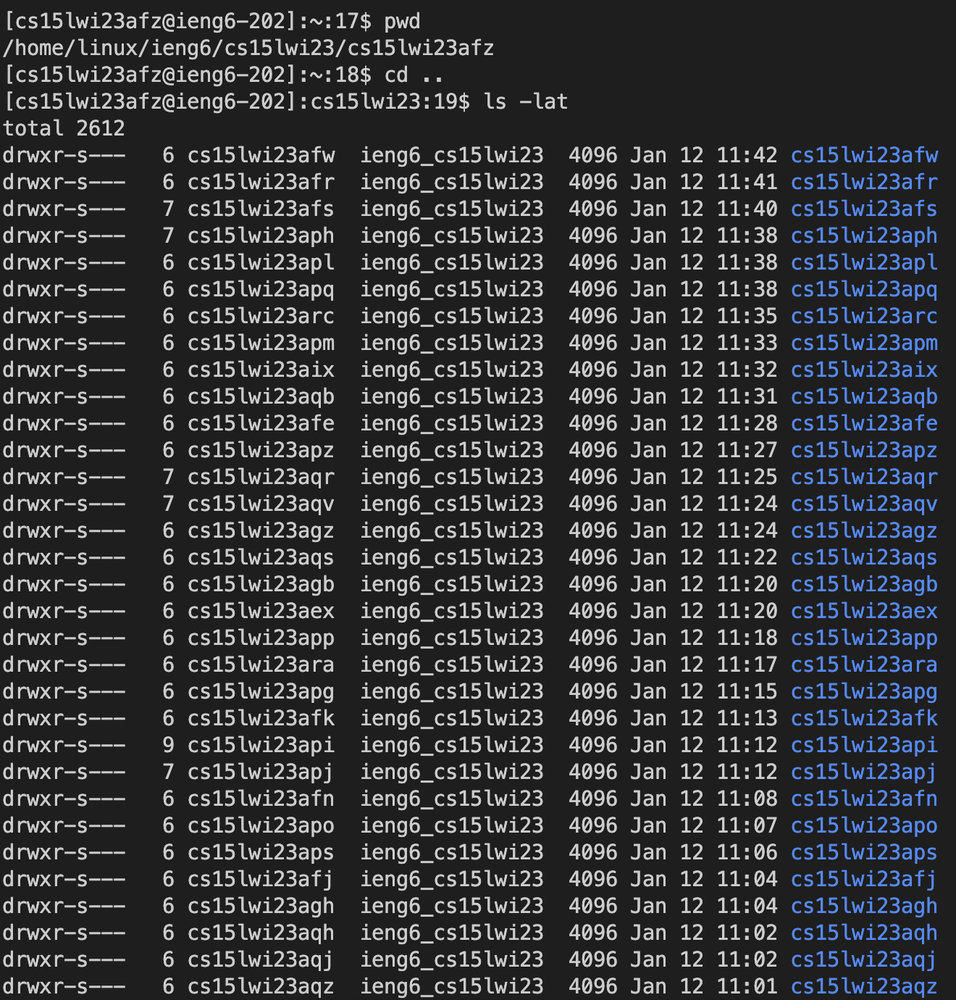

# Lab Report 1 - Remote Acess
Goal: logging into a course-specific account on *ieng6*

## Step 1: Installing VScode
1. Download Visual Studio Code through [here](https://code.visualstudio.com/).
   * Follow instructions on the website to download properly.
3. Once downloaded, the starting screen should look similar to this:
   

## Step 2: Remotely Connecting
1. Install git through [here](https://git-scm.com/downloads).
2. Inside VScode, open a new terminal.
   * Terminal -> New Terminal
3. Enter: 
   ```
   $ ssh cs15lwi23zzz@ieng6.ucsd.edu
   ```
   * instead of zzz, type in the letters from the given course specific account
4. If it's the first time signing in, there will be a message asking if you're sure you want to continue connecting. Type yes and hit enter.
5. Enter your password and the following message should show up.
   

## Step 3: Using commands
1. Here are some common commands to use:
   ```
   * cd - change directory
   * ls - list
   * pwd - print working directory
   * mkdir - make new directory
   * cp - copy
   ```
2. Here is an example combination of commands.
   
3. To exit the remote server, type ```exit``` in the terminal.


 
   
